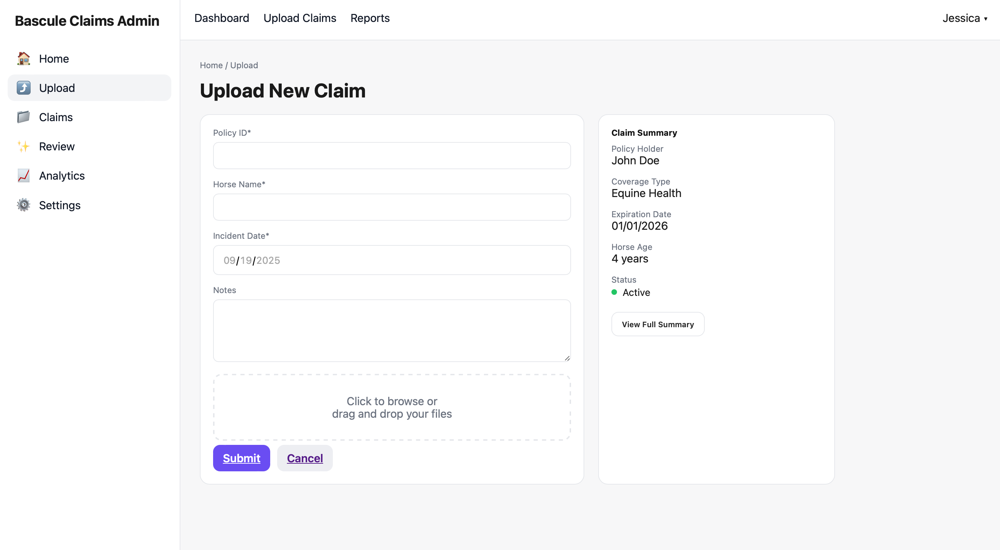
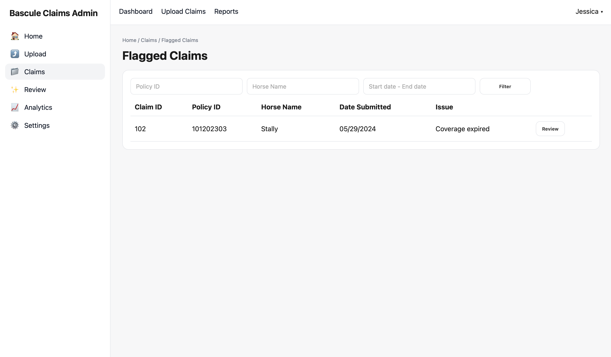
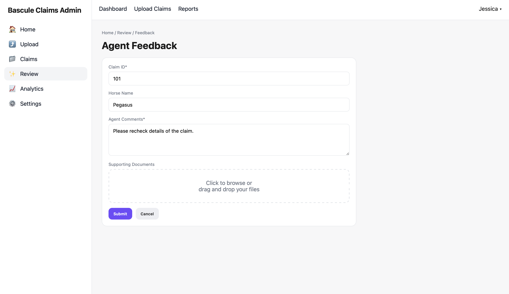

# Bascule Admin

A **Flask-based web application** for managing insurance claim workflows.  
This project provides routes and templates for uploading claim files, reviewing flagged claims, collecting agent feedback, and supporting manual reviews — designed as a foundation for future claims analysis.

---

## 🚀 Features
- 📂 Upload claim files for processing
- ⚠️ Review and manage flagged claims
- 📝 Capture and display agent feedback
- 👨‍💻 Support manual review processes
- 🔍 Search and filter claims (future-ready)
- 🏗️ Modular structure for future integrations

---

## 📸 Screenshots

### Upload Page


### Flagged Claims


### Agent Feedback


### Manual Review


---

## 🛠️ Tech Stack
- **Backend**: Flask  
- **Frontend**: HTML, CSS, Bootstrap  
- **Templating**: Jinja2  
- **Future Integrations**: Data analysis engine, cloud storage  

---

## ⚡ Quickstart

```bash
# Clone repository
git clone https://github.com/daluko-1/bascule-project.git
cd bascule-project

# Create virtual environment
python3 -m venv venv
source venv/bin/activate   # Mac/Linux
venv\Scripts\activate      # Windows

# Install dependencies
pip install -r requirements.txt

# Run app
flask run
